# Motion Transfer Pipeline Overview

Image-to-video (i2v) motion transfer for Wan TI2V-5B: learn motion from a **driver video** (generated from `cat.png`), then generate a new video from **`corgi.png`** that follows the same motion, guided by text.

All tasks remain **i2v**: the **first-frame latent is fixed** from the input image; only later frames are denoised.

---

## Pipeline graph (Mermaid)

```mermaid
flowchart TB
    subgraph TRAIN["Training (train_motion.py)"]
        DV["Driver video<br/>kling_20260512.mp4"]
        CAT["Ref image<br/>cat.png"]
        PROMPT["Text prompt"]

        DV --> ALIGN_T["Align & resize frames<br/>to cat.png aspect / max_area"]
        CAT --> ALIGN_T

        ALIGN_T --> VAE_ENC_T["Wan VAE encode<br/>full video → target_z"]
        ALIGN_T --> VAE_1_T["Wan VAE encode<br/>frame 0 → cond_z"]
        ALIGN_T --> CLIP_ENC_T["MotionClipEncoder<br/>OpenCLIP ViT + temporal TF"]

        CLIP_ENC_T --> MT_T["32 motion tokens<br/>512-d"]
        MT_T --> ADAPTER_T["MotionContextAdapter<br/>MLP → 3072-d"]

        PROMPT --> T5_T["T5-XXL text encoder"]
        T5_T --> CTX_T["Text context tokens"]

        VAE_ENC_T --> FM_T["Flow-matching loss<br/>noisy latent + mask"]
        VAE_1_T --> FM_T
        ADAPTER_T --> DIT_T["WanModelWithMotion (frozen)<br/>motion tokens ‖ text → cross-attn"]
        CTX_T --> DIT_T
        FM_T --> DIT_T

        DIT_T --> LOSS["MSE(pred, noise − target_z)"]
        LOSS --> UPD["Update motion encoder + adapter only"]
        UPD --> CKPT["checkpoints/motion_transfer.pt"]
    end

    subgraph INFER["Inference (generate_motion.py)"]
        DV2["Driver video"]
        CAT2["motion_ref_image<br/>cat.png (crop align)"]
        CORGI["Target image<br/>corgi.png"]
        PROMPT2["Text prompt"]
        CKPT2["motion_transfer.pt"]

        DV2 --> ALIGN_I["Align frames to cat.png geometry"]
        CAT2 --> ALIGN_I
        ALIGN_I --> CLIP_ENC_I["MotionClipEncoder"]
        CKPT2 --> CLIP_ENC_I
        CKPT2 --> ADAPTER_I["MotionContextAdapter"]

        CLIP_ENC_I --> MT_I["Motion tokens"]
        MT_I --> ADAPTER_I

        CORGI --> PRE_I["Resize / center-crop"]
        PRE_I --> VAE_1_I["VAE encode frame 0 → z"]
        PRE_I --> I2V["Wan TI2V i2v sampling loop"]

        PROMPT2 --> T5_I["T5 encoder"]
        T5_I --> CTX_I["Text context"]
        ADAPTER_I --> DIT_I["WanModelWithMotion"]
        CTX_I --> DIT_I
        VAE_1_I --> I2V
        MT_I --> DIT_I

        I2V --> DIT_I
        DIT_I --> VAE_DEC["VAE decode"]
        VAE_DEC --> OUT["Output video<br/>corgi + transferred motion"]
    end

    subgraph ARCH["Motion module detail"]
        F1["Frame t"] --> CLIP_V["CLIP ViT-B/32<br/>frozen"]
        F2["Frame t−1"] --> CLIP_V
        CLIP_V --> DELTA["Δ = feat_t − feat_{t−1}"]
        CLIP_V --> CONCAT["concat feat, Δ"]
        DELTA --> CONCAT
        CONCAT --> TEMP["Temporal Transformer"]
        TEMP --> Q["32 learnable queries"]
        Q --> CROSS["Cross-attention"]
        TEMP --> CROSS
        CROSS --> TOK["32 × 512 motion tokens"]
        TOK --> MLP["MLP × scale → 3072"]
        MLP --> INJECT["Prepend to T5 context<br/>in every DiT block cross-attn"]
    end
```



---

## High-level goal

| Asset | Path | Role |
|-------|------|------|
| Driver video | `examples/kling_20260512.mp4` | Source of motion (and training reconstruction target) |
| Original first frame | `examples/cat.png` | Spatial alignment reference for driver / training |
| New appearance | `examples/corgi.png` | First frame at inference |
| Checkpoint | `checkpoints/motion_transfer.pt` | Trained motion encoder + adapter |

---

## Phase A — Training (`train_motion.py`)

### Inputs

| Input | Role |
|-------|------|
| Driver video (`kling_20260512.mp4`) | Ground-truth motion + appearance to reconstruct |
| Ref image (`cat.png`) | Defines crop / aspect (same as original i2v) |
| Text prompt | Same semantic description as original generation |
| Wan TI2V-5B checkpoint | Frozen backbone (VAE, T5, DiT) |

### Step 1 — Video preprocessing

- Sample `T` frames (e.g. 49 with `--low_vram`, 81 at full settings).
- Resize and center-crop each frame to match `cat.png` layout and `max_area` (e.g. `832×480` or `1280×704`).
- Tensor layout: `[B, T, 3, H, W]` in `[-1, 1]`.

### Step 2 — Latent targets (frozen Wan VAE)

- Encode full video → `target_z`, shape `[C_z, T_z, H_z, W_z]` (e.g. `48×13×44×34`).
- Encode first frame only → `cond_z` (i2v conditioning).
- Optional cache: `checkpoints/motion_transfer_latents.pt` (skips re-encoding on reruns).

### Step 3 — Motion features (trainable `MotionClipEncoder`)

1. Per frame: OpenCLIP ViT-B/32 → 512-d embedding (CLIP weights frozen).
2. Temporal delta: `feat_t − feat_{t−1}`.
3. Concatenate `[feat, delta]` → linear projection → 512-d per timestep.
4. Small temporal Transformer over time.
5. 32 learnable query tokens + cross-attention → **32 motion tokens × 512**.

### Step 4 — Text conditioning (frozen T5)

- Prompt → T5-XXL → text tokens `[L, 4096]` → Wan text embedding → `[L, 3072]`.

### Step 5 — Inject motion into DiT (`WanModelWithMotion`)

- `MotionContextAdapter`: MLP maps `512 → 3072` (Wan hidden size), with a learnable scale.
- **Concatenate** motion tokens **before** text tokens in cross-attention context (same idea as Wan-Animate CLIP tokens).
- Wan DiT (5B, 30 layers) remains **frozen**.

### Step 6 — Flow-matching training step

- Sample noise and timestep `t`.
- Build noisy latent: interpolate `target_z` and noise; **overwrite first latent frame** with `cond_z` (i2v mask).
- DiT predicts velocity / noise residual.
- Loss: `MSE(prediction, noise − target_z)`.
- Backprop **only** into motion encoder (optional) + motion adapter.
- Gradient checkpointing on DiT blocks during training to reduce VRAM.

### Training output

- `checkpoints/motion_transfer.pt` — weights for `MotionClipEncoder` + `MotionContextAdapter`.

### Example command

```bash
python train_motion.py \
  --ckpt_dir ../Wan2.2-TI2V-5B \
  --driver_video examples/kling_20260512.mp4 \
  --ref_image examples/cat.png \
  --prompt "the cute cat raises its right paw and licking the paw repeatedly, satisfied and gently" \
  --frame_num 81 \
  --steps 500 \
  --low_vram \
  --output checkpoints/motion_transfer.pt
```

---

## Phase B — Inference (`generate_motion.py`)

### Inputs

| Input | Role |
|-------|------|
| `corgi.png` | New appearance (first frame) |
| `cat.png` as `motion_ref_image` | Same crop geometry as driver video |
| Driver video | Motion source (or cached motion `.pt`) |
| `motion_transfer.pt` | Learned motion modules |
| Prompt | Describes corgi action |

### Steps

1. Extract motion from driver video (aligned with `cat.png`) → 32 motion tokens.
2. Load `corgi.png` → preprocess → VAE encode first frame → `z`.
3. T5-encode prompt.
4. Standard Wan i2v diffusion loop (UniPC / flow matching):
   - Latent noise for future frames; frame 0 fixed from `z`.
   - Each step: DiT with **motion tokens + text** (CFG: motion disabled on unconditional branch).
5. VAE decode → output MP4.

### Design choice

- **Motion** is largely appearance-agnostic in CLIP space.
- **Appearance** comes from `corgi.png` + prompt.
- **Motion** comes from driver video features.

### Example command

```bash
python generate_motion.py \
  --ckpt_dir ../Wan2.2-TI2V-5B \
  --motion_ckpt checkpoints/motion_transfer.pt \
  --image examples/corgi.png \
  --motion_ref_image examples/cat.png \
  --motion_video examples/kling_20260512.mp4 \
  --prompt "the cute corgi raises its right paw and licking the paw repeatedly, satisfied and gently" \
  --size 1280*704 \
  --frame_num 81 \
  --offload_model True \
  --convert_model_dtype \
  --t5_cpu \
  --save_file output/corgi_motion.mp4
```

---

## Tensor-level data flow

```
Driver video frames [T, H, W]
    ├─→ VAE → target_z          (training only)
    └─→ CLIP (+ temporal) → 32×512 → MLP → 32×3072 ─┐
                                                     ├─→ DiT cross-attention context
Prompt → T5 → L×3072 ───────────────────────────────┘

Target image (corgi) → VAE frame-0 → z → masked into latent slot 0
Noise latents (frames 1…T−1) → iterative denoise with DiT
    → VAE decode → video
```

---

## Module map (code)

| Component | File |
|-----------|------|
| `MotionClipEncoder` | `wan/modules/motion_transfer/clip_encoder.py` |
| `MotionContextAdapter` | `wan/modules/motion_transfer/adapter.py` |
| `WanModelWithMotion` | `wan/modules/motion_transfer/model.py` |
| `WanTI2VMotion` pipeline | `wan/textimage2video_motion.py` |
| Training script | `train_motion.py` |
| Inference script | `generate_motion.py` |
| Motion cache utility | `extract_motion.py` |

---

## VRAM and resolution

| Mode | Resolution | Frames | GPU notes |
|------|------------|--------|-----------|
| Training `--low_vram` | `832×480` | 49 | Fits ~24GB; DiT offloaded between steps |
| Training (full) | `1280×704` | 81 | Needs 40GB+; OOM on 24GB |
| Inference | `1280×704` | 81 | Same as base Wan i2v with `--offload_model` |

Training and inference resolutions may differ; the motion adapter maps tokens into DiT context and is not tied to a single latent grid size.

---

## Suggested figure layout (for external diagram tools)

### Panel 1 — Training

- **Left:** driver video + cat reference → preprocessing.
- **Center:** three branches (VAE latents, CLIP motion, T5 text) merging into frozen DiT.
- **Right:** loss arrow into small trainable block (Motion Encoder + Adapter).

### Panel 2 — Inference

- **Top:** driver → motion branch.
- **Bottom:** corgi → appearance branch.
- **Merge** at DiT → VAE decode → output video.

### Panel 3 — Motion encoder (zoom-in)

Frames → CLIP → temporal deltas → Temporal Transformer → 32 query tokens → cross-attention → MLP → prepend to text context in every DiT block.

---

## Related docs

- Quick start: [`motion_transfer.md`](motion_transfer.md)
- Base Wan i2v: [`inference.md`](inference.md)
